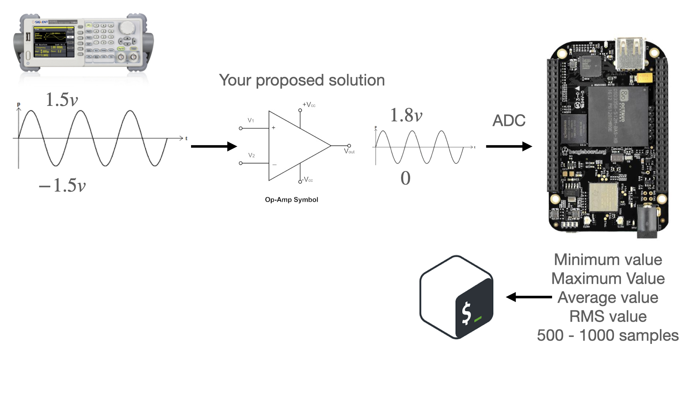

# adc-sampler
Implement the next Data logger for the adc using C to program the function to collet 500-1000 samples and computes the required data.



## Introduction
An ADC (Analog-Digital-Converter) is an electronic part or device that can process a variable signal, and convert that signal in data that can be understood by a computer. In other words, a voltage in a specific range can be interpreted in binary information, in the case of Beaglebone Black the voltage range is 0 - 1.8V, and the data range is 0 - 4095, 12 bits of data.

## Requirements
The program needs to read a cuantity of samples between 500 and 1000. And complete the next:

1. Minimum value
2. Maximum value
3. Mean value
4. Median value
5. RMS value
6. Histogram

## Methodology
The voltage is going to be given by a signal generator, in specific a sine wave with a positive voltage of 1.5V and negative voltage of -1.5V, that means an amplitude of 3V. Now, the BBB can't read negative voltage, so the next part is eliminate that and reduce the amplitud voltage from 0 to 1.8V. So, it is necessary to use OPAMPs (Operatinal Amplifiers) with the next configuration.

The CI (Circuit Integrat) for this experimet is LM324N, it is a CI with 4 OPAMPs.

Then, we have to add one AA battery to move the offset of the signal to the positive voltage with the next configuration. The values of the resistors are 1k Ohms (6), 2k Ohnms (1) and 4k Ohms (1).

## Program
To obtain the minimum value the program reads the signal in one specific time, then another sample, if the new value of the sample is lower than the actual, the variable of the minimum value is replaced with the new one, and it is going to be repeated until the max cuantity of samples is reached.

To obtain the maximum valur is the same way as the minimum, with this difference: the variable of the maximum value is going to be replaced only if the new sample value is bigger than the actual.

The mean value is obtained dividing the sum of all values in a data set by the number of values.

To obtain the median is necessary to order the values from the lowest to the highest value. Then we pick the value that is in the middle of all the samples values.

Now, the way to obtain the RMS value is with this formula:
*
Calculate the square root of the sum of all squared values divided by the number os samples.

The histogram is a little graphic that shows all the sample values divided in differents ranges. There are 16 different ranges in total, so, the range number 1 starts with 0 and finishes with 255, then to the next range just add 256 to the minimum and maximum value of the range, and continue doing that until you arrive to 4095. If a value enters in one specefic range, the histogram shows it with a `x`.

## How to use the C program
If you want to execute the C program, it is necessary to install the `gcc` compiler. Use the next command:
```
sudo apt-get install gcc
```

Then you have to compile the C program to create a new archive that can be executed. You can type the name of the new archive, we recommed you to use a name that is ralated to the program, like: `adc-meas` from ADC measurement.
````
gcc main.c -o adc-meas -lm
````
If you don´t add the `lm` command, the math library can't be used, so you can't use the square root calculation.

The final part is to execute the program with the name of the new archive and a number of samples between 500 and 1000.
````
./adc-meas 500
````

